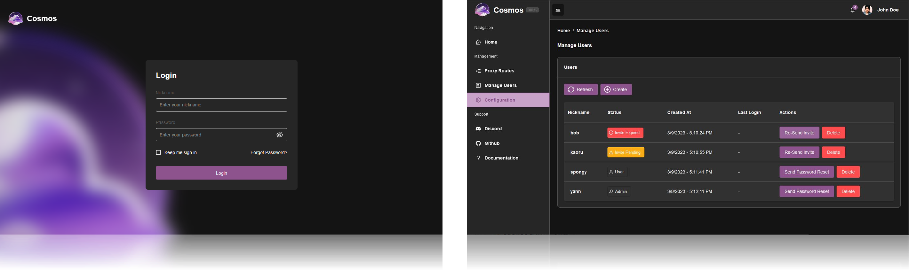
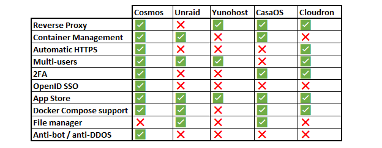
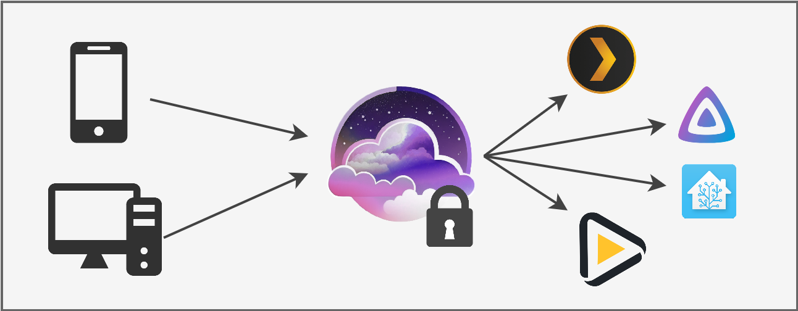
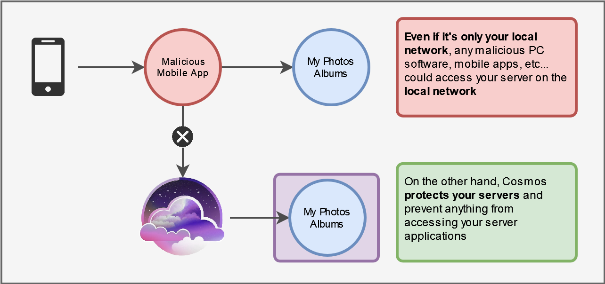
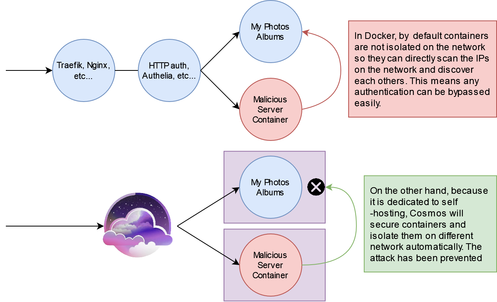

---

<!-- sponsors -->
<h3 align="center">Thanks to the sponsors:</h3></br>
<p align="center"><a href="https://github.com/DrMxrcy"></a>
<a href="https://github.com/BakaDalek"></a>
<a href="https://github.com/soldier1"></a>
<a href="https://github.com/devcircus"></a>
<a href="https://github.com/BlackrazorNZ"></a>
<a href="https://github.com/owengraven"></a>
<a href="https://github.com/DGAzr"></a>
<a href="https://github.com/Dimtar"></a>
</p><!-- /sponsors -->

---

[](https://discord.gg/PwMWwsrwHA)  [](https://hub.docker.com/r/azukaar/cosmos-server)


☁️ Cosmos is the most secure and easy way to selfhost a Home Server. It acts as a secure gateway to your application, as well as a server manager. It aims to solve the increasingly worrying problem of vulnerable self-hosted applications and personal servers.

<p align="center">
  <br/>
  <br/>
  <a target="_blank" href="https://cosmos-cloud.io/">
    
  </a>
  <a target="_blank" href="https://cosmos-cloud.io/doc">
    
  </a>
  <a target="_blank" href="https://cosmos-cloud.io/cosmos-ui">
    
  </a>
  <br/>
  <br/>
</p>



Whether you have a **server**, a **NAS**, or a **Raspberry Pi** with applications such as **Plex**, **HomeAssistant** or even a blog, Cosmos is the perfect solution torun and secure them all. Simply install Cosmos on your server and connect to your applications through it to enjoy built-in security and robustness for all your services, right out of the box.

Cosmos is a: 

 * **App Store** 📦📱 To easily install and manage your applications, with simple installers, automatic updates and security checks. This works alongside manual installation methods, such as importing docker-compose files, or the docker CLI
 * **Customizable Homepage** 🏠🖼 To access all your applications from a single place, with a beautiful and customizable UI
 * **Reverse-Proxy** 🔄🔗 Targeting containers, other servers, or serving static folders / SPA with **automatic HTTPS**, and a **nice UI**
 * **Authentication Server** 👦👩 With strong security, **multi-factor authentication** and multiple strategies (**OpenId**, forward headers, HTML)
 * **Container manager** 🐋🔧 To easily manage your containers and their settings, keep them up to date as well as audit their security. Includes docker-compose support!
 * **VPN** 🌐🔒 To securely access your applications from anywhere, without having to open ports on your router.
 * **Monitoring** 📈📊 Fully persisting and real-time monitoring with customizable alerts and notifications, so you can be notified of any issue.
 * **Identity Provider** 👦👩 To easily manage your users, **invite your friends and family** to your applications without awkardly sharing credentials. Let them request a password change with an email rather than having you unlock their account manually!
 * **SmartShield technology** 🧠🛡 Automatically secure your applications without manual adjustments (see below for more details). Includes anti-bot and anti-DDOS strategies.

 It has been built to be:

 * **Easy to use** 🚀👍 to install and use, with a simple web UI to manage your applications from any device
 * **Powerful** 🧠🔥 Being easy does not mean being dumb: while Cosmos is easy to use, it is also powerful and flexible, you can even use it from the terminal if you want to!
 * **User-friendly** 🧑‍🎨 For both new and experienced users: easily integrates into your existing home server, the already existing applications you have, and the new ones you want to install
 * **Secure** 🔒🔑 Connect to all your applications with the same account, including **strong security**, **multi-factor authentication** and **OpenId**. Cosmos encrypt your data and protect your privacy. Security by design, and not as an afterthought
 * **Anti-Bot** 🤖❌ Collection of tools to prevent bots from accessing your applications, such as common bot detection, IP based detection, and more
 * **Anti-DDOS** 🔥⛔️ Additional protections such as variable timeouts/throttling, IP rate limiting and geo-blacklisting
 * **Modular** 🧩📦 to easily add new features and integrations, but also run only the features you need (for example No docker, no Databases, or no HTTPS)
 
And a **lot more planned features** are coming!

# What are the differences with other alternatives?

Cosmos has a few key differences with other alternatives such as YunoHost, Unraid, etc...

<p align="center" style="color:grey">
  <br />
  * Only containers created with their UI, with no customization, * No alerts
</p>


* **Security**: Cosmos has a unique strong focus on securing your application with exclusive features such as the smart-shield. It has 2FA, OpenID, anti-DDOS, and other security features built-in. It also has a strong focus on privacy, with the latest encryption methods and a strong focus on data protection. Unlike any other solutions, it assumes the software you run are not trustworthy, and protects you from them.
* **Power-user friendly**: Some of those alternatives can feel a bit "limiting" to someone who kows what they are doing. On the other hand, while Cosmos is designed to be easy to use, it is also powerful and flexible. It is designed to be used by both new and experienced users, and to integrate into your existing home server, the already existing applications you have, and the new ones you want to install. It can even be used from the terminal if you want to!
* **Flexible**: Unlike the alternatives, Cosmos is not exclusively focused around its app-store. Instead, it lets you freely install any application any way you want, and manage them from the UI, from Portainer, or from docker directly. Any of those applications will still be integrated into Cosmos and will also benefit from all the security features, Let's Encrypt, etc...
* **Learning experience**: If you are new to selfhosting, using a software that hides all the complexity from you can prevent you from learning how to properly manage your server. Cosmos is designed to be easy to use, but also to be a learning experience. It does not hide things away but instead guides you and proposes you to learn more about the tools you are using.
* **No vendor-locking**: Unlike solution that tightly couple their applications to the containers, Cosmos can manage apps created from anywhere all the same, and converting an existing container to a Cosmos app is as simple as adding a URL in the UI. You can also migrate out of Cosmos at any time, as it only uses vanilla docker containers.

You might also wonder about **cloudflare proxy** and **cloudflare tunnel** when it comes to security. But unlike popular beliefs those are not solutions on their own as:

 * While they protect your remote access to your applications, they leave your origin server completely unprotected. A rogue device / application in your local network would have no troubles taking advantage of it
 * Those options let **Cloudflare see your entire network unencrypted**. Yes, even if you use HTTPS: Cloudflare proxy de-encrypt your traffic, to re-encrypt it. Meaning that everything that goes through your traffic is plain readable text to Cloudflare. On the other hand, Cosmos is self-hosted so you stay in control of your data.

# What is the SmartShield?

SmartShield is a modern API protection package designed to secure your API by implementing advanced rate-limiting and user restrictions. This helps efficiently allocate and protect your resources without manual adjustment of limits and policies.

<p align="center">
  
</p>

Key Features:

  * **Dynamic Rate Limiting** ✨ SmartShield calculates rate limits based on user behavior, providing a flexible approach to maintain API health without negatively impacting user experience.
  * **Adaptive Actions** 📈 SmartShield automatically throttles users who exceed their rate limits, preventing them from consuming more resources than they are allowed without abruptly terminating their requests.
  * **User Bans & Strikes** 🚫 Implement temporary or permanent bans and issue strikes automatically to prevent API abuse from malicious or resource-intensive users.
  * **Global Request Control** 🌐 Monitor and limit with queues the total number of simultaneous requests on your server, ensuring optimal performance and stability.
  * **User-based Metrics** 📊 SmartShield tracks user consumption in terms of requests, data usage, and simultaneous connections, allowing for detailed control.
  * **Privileged Access** 🔑 Assign privileged access to specific user groups, granting them exemption from certain restrictions and ensuring uninterrupted service even durin attacks.
  * **Customizable Policies** ⚙️ Modify SmartShield's default policies to suit your specific needs, such as request limits, time budgets, and more.

# Why use Cosmos?

If you have your own self-hosted data, such as a Plex server, or may be your own photo server, **you expose your data to being hacked, or your server to being highjacked** (even on your **local network**!).

It is becoming an important **threat to you**. Managing servers, applications and data is **very complex**, and the problem is that **you cannot do it on your own**: how do you know that the server application where you store your family photos has a secure code? it was never audited. 

**Even a major application such as Plex** has been **hacked** in the past, and the data of its users has been exposed. In fact, the recent LastPass leak happened because a LastPass employee had a Plex server that **wasn't updated to the last version** and was missing an important **security patch**!

That is the issue Cosmos Server is trying to solve: by providing a secure and robust way to run your self-hosted applications, **you can be sure that your data is safe** and that you can access it without having to worry about your security.

Here's a simple example of how Cosmos can help you:



Another example:



Additionally, because every new self-hosted applications re-implement **crucial systems** such as authentication **from scratch** everytime, the **large majority** of them are very succeptible to being **hacked without too much trouble**. This is very bad because not only Docker containers are not isolated, but they also run as **root** by default, which means it can **easily be used** to offer access to your entire server or even infrastructure.

Most tools currently used to self-host **not specifically designed to be secure for your scenario**. Entreprise tools such as Traefik, NGinx, etc... Are designed for different use-cases that assume that the code you are running behind them is **trustworthy**. But who knows what server apps you might be running? On top of that, a lot of reverse-proxies and security tools lock important security features behind 3 to 4 figures business subscriptions that are not realistic for selfhosting. 

If you have any further questions, feel free to join our [Discord](https://discord.gg/PwMWwsrwHA)!

```
Disclaimer: Cosmos is still in early Alpha stage, please be careful when you use it. It is not (yet, at least ;p) a replacement for proper control and mindfulness of your own security.
```

# Let's Encrypt

Cosmos Server can automatically generate and renews HTTPS certificates for your applications using Let's Encrypt. It is compatible with wildcard certificates, using the DNS challenge. In order to do it, you need to add `DNSChallengeProvider` to the `HTTPConfig` in your config (or in the UI). And then add the proper API token via environment variables. To know what providers are supported and what environment variable they need, please refer to [this page](https://go-acme.github.io/lego/dns/#dns-providers).

# As A Developer

**If you're a self-hosted application developer**, integrate your application with Cosmos and enjoy **secure authentication**, **robust HTTP layer protection**, **HTTPS support**, **user management**, **encryption**, **logging**, **backup**, and more - all with **minimal effort**. And if your users prefer **not to install** Cosmos, your application will **still work seamlessly**.

Authentication is very hard (how do you check the password match? What encryption do you use? How do you store tokens? How do you check if the user is allowed to access the application?). Cosmos Server provides a **secure authentication system** that can be used by any application, and that is **easy to integrate**.

# Licence

Cosmos is using the Apache 2.0 Licence with the Commons Clause 1.0. This is a common clause among open source infrastructure software, such as databases, reverse proxies, etc...

The TL;DR is: You can use it freely. You can also fork it and redistribute it, But you are not allowed to sell it, a derivative or to sell a service based on it (ex. SaaS or PaaS).

Note that **you are allowed** to use it to host a monetized business website, a blog etc... as long as your business does not involve selling Cosmos or its features.

# Installation

Installation is simple using Docker:

```
docker run -d -p 80:80 -p 443:443 -p 4242:4242/udp --privileged --name cosmos-server -h cosmos-server --restart=always -v /var/run/docker.sock:/var/run/docker.sock -v /:/mnt/host -v /var/lib/cosmos:/config azukaar/cosmos-server:latest
```

#### DO NOT USE UNRAID TEMPLATES OR PORTAINER STACKS TO INSTALL COSMOS. IT WILL NOT WORK PROPERLY.

in this command, `-v /:/mnt/host` is optional and allow to manage folders from Cosmos, you can remove it if you don't want it but you will have to create your container's bind folders manually.

`--privileged` is also optional, but it is required if you use hardening software like AppArmor or SELinux, as they restrict access to the docker socket. It is also required for Constellation to work. If you don't want to use it, you can add the following capabilities: NET_ADMIN for Constellation.

Once installed, simply go to `http://your-server-ip` and follow the instructions of the setup wizard. **always start the install with the browser in incognito mode** to avoid issues with your browser cache.

Port 4242 is a UDP port used for the Constellation VPN.

make sure you expose the right ports (by default 80 / 443). It is best to keep those ports intacts, as Cosmos is meant to run as your reverse proxy. Trying to setup Cosmos behind another reverse proxy is possible but will only create headaches.

You also need to keep the docker socket mounted, as Cosmos needs to be able to manage your containers.

You can tweak the config file accordingly. Some settings can be changed before end with env var. [see here](https://cosmos-cloud.io/doc/9%20Other%20Setups/#env-var).

if you are having issues with the installation, please contact us on [Discord](https://discord.gg/PwMWwsrwHA)!
